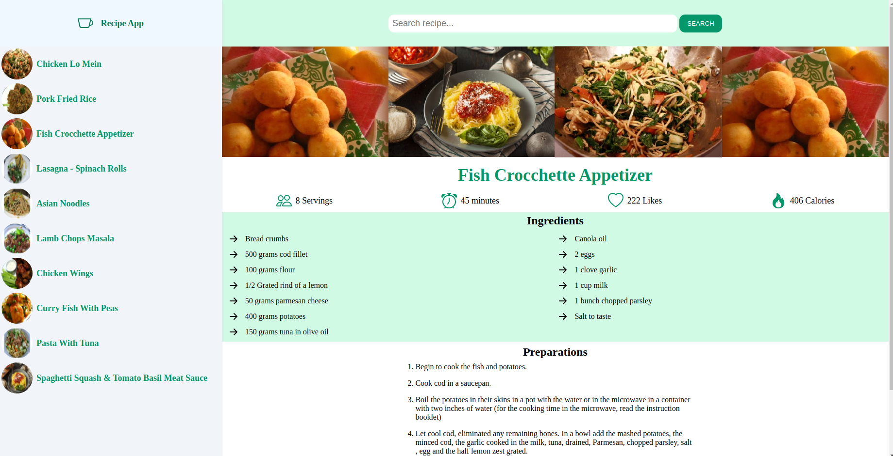

# Phase-1-Recipe-project




## Project author
Linet Makena


## Problem Statement
 The idea behind this is to solve the problem of lacking recipes of creating different meals in ease.

## Proposed Solution
Creating different recipes for different foods and how to prepare them.


## Objectives
- List of recipes
- Users can be able to search for recipes
- Users can be able to get ingredient details and how to prepare a certain food.

## Live link
 The application can be accessed from this [url](https://glittering-taffy-1760d2.netlify.app/)

 ## Technologies Used 
 I built this app with 
- HTML 
- CSS
- JavaScript. 

## Setup and Installation
To test this app on your local pc follow the following steps:
```text
git clone git@github.com:LGMAKENA/Phase-1-Recipe-project.git
cd Phase-1-Recipe
code .
npx json-server --watch recipes.json
```

## API Endpoint
For local development  the endpoint used is 
```text
http://localhost:3000
```
For live environment  the endpoint used is 
```text
https://recipes-g6go.onrender.com/recipes
```

## About Author
To contribute to this application or report bugs reach out to [linetmakenag@gmail.com](mailto:linetmakenag@gmail.com)

## Future plans 
To add more recipes on the list and invite ideas from diferent food enthusists.